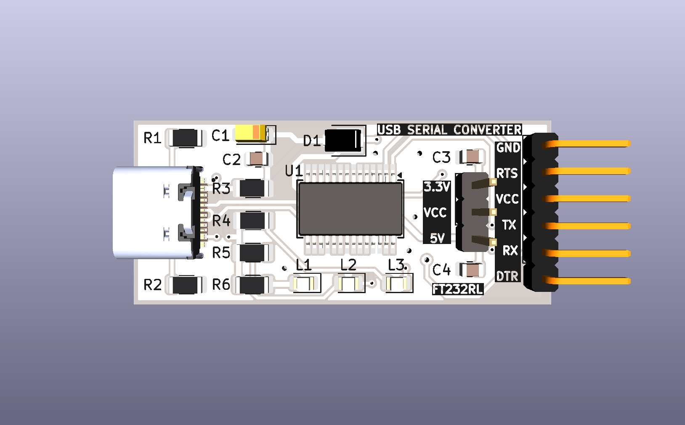
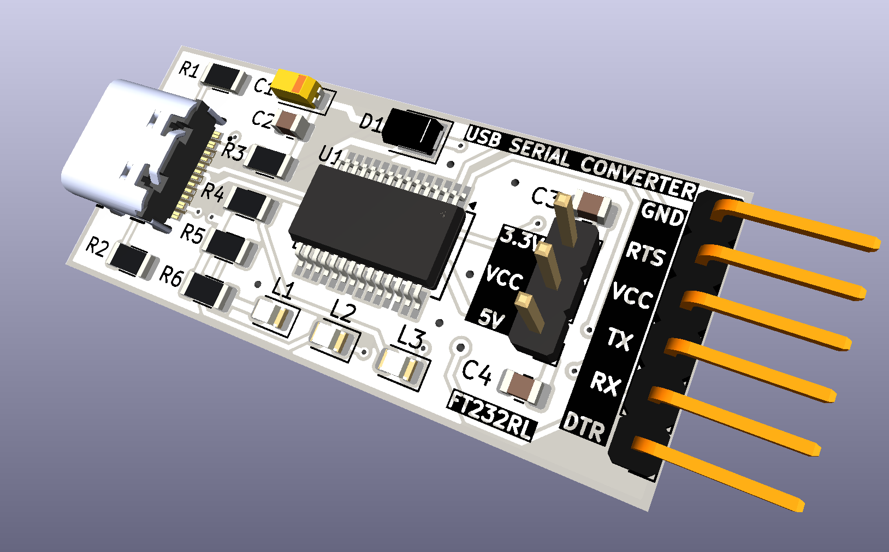

<div align="center">



# FTDI232 COM RTS

**Conversor USB-Serial compacto com conector USB-C, chip FT232RL, seleção de tensão 3,3V / 5V, 3 LEDs de status e saída com pino RTS — totalmente SMD**

[](https://www.kicad.org/)
[](.)
[](.)
[](.)
[](.)
[](.)
[](.)

</div>

---

## 📋 Índice

- [FTDI232 COM RTS](#ftdi232-com-rts)
  - [📋 Índice](#-índice)
  - [Visão Geral](#visão-geral)
  - [Renders 3D](#renders-3d)
  - [Funcionalidades](#funcionalidades)
  - [Diagrama de Blocos](#diagrama-de-blocos)
  - [Especificações Técnicas](#especificações-técnicas)
  - [Lista de Materiais](#lista-de-materiais)
  - [Pinagem dos Conectores](#pinagem-dos-conectores)
    - [J2 — Saída Serial (6 pinos angulado)](#j2--saída-serial-6-pinos-angulado)
    - [JP1 — Seleção de Tensão](#jp1--seleção-de-tensão)
  - [Seleção de Tensão — JP1](#seleção-de-tensão--jp1)
  - [Aplicações](#aplicações)
  - [Estrutura do Repositório](#estrutura-do-repositório)
  - [Como Usar](#como-usar)
    - [Conexão com Arduino (programação)](#conexão-com-arduino-programação)
    - [Conexão com ESP8266 / ESP32](#conexão-com-esp8266--esp32)
    - [Instalação de drivers](#instalação-de-drivers)
  - [Sobre](#sobre)

---

## Visão Geral

**FTDI232 COM RTS** é um módulo conversor **USB para Serial (UART)** compacto e totalmente SMD, projetado pela **ZAT ELECTRONIC** utilizando **KiCad 10**. O módulo é baseado no chip **FT232RL** (SSOP-28), reconhecido automaticamente pelo sistema operacional sem necessidade de drivers adicionais na maioria das plataformas.

O diferencial deste módulo em relação a conversores convencionais é a presença do **pino RTS** no conector de saída de 6 pinos, além do tradicional conjunto **GND / VCC / TX / RX / DTR**. A tensão de saída é selecionável entre **3,3V e 5V** via jumper **(JP1)**, tornando o módulo compatível com uma ampla variedade de microcontroladores e módulos seriais. A entrada USB utiliza o conector **USB-C** (USB4105GFA SMD).

> 💡 Ideal para programação de Arduino bootloader, ESP8266, ESP32 sem USB nativo, módulos GSM, GPS e qualquer dispositivo com interface UART.

---

## Renders 3D

<div align="center">


*Vista superior — FT232RL SSOP-28, USB-C, LEDs SMD 0805, jumper JP1 e conector de 6 pinos*

<br/>



*Vista isométrica — layout compacto SMD com saída de 6 pinos angulada*

</div>

---

## Funcionalidades

- ✅ **Chip FT232RL** (SSOP-28 SMD) — conversor USB-Serial confiável e amplamente suportado
- ✅ **Conector USB-C** (USB4105GFA SMD) — entrada USB moderna e resistente
- ✅ **Seleção de tensão 3,3V / 5V** via jumper JP1 — compatível com diferentes lógicas
- ✅ **Pino RTS** disponível no conector de saída — diferencial para reset automático
- ✅ **Pino DTR** disponível — reset automático de Arduino e bootloaders
- ✅ **3 LEDs SMD 0805** (L1, L2, L3) — indicação visual de TX, RX e alimentação
- ✅ **Diodo Schottky SS1P3L** (D1, DO-220AA SMD) — proteção na linha de alimentação VBUS
- ✅ **Capacitor eletrolítico 10µF/16V** (C1, EIA-3216 SMD) — filtragem da alimentação
- ✅ **Capacitores de desacoplamento 100nF e 1µF** (C2, C3, C4 — 0805 SMD)
- ✅ **Resistores de proteção e pull-up** (R1–R6 — 1206 SMD)
- ✅ **Layout totalmente SMD** — compacto e profissional
- ✅ **Saída por header de 6 pinos angulado** (J2) — encaixe direto em cabos e módulos

---

## Diagrama de Blocos

```
┌─────────────┐       ┌──────────────────┐       ┌─────────────────────────┐
│  USB-C      │       │   FT232RL        │       │  Conector J2 (6 pinos)  │
│ USB4105GFA  │──────►│   SSOP-28        │──────►│  GND                    │
│             │  USB  │                  │       │  RTS  ← diferencial     │
│  D+ / D-   │       │  TX / RX / DTR   │       │  VCC (3,3V ou 5V)       │
└─────────────┘       │  RTS / CTS       │       │  TX                     │
                      │  CBUS0 / CBUS1   │       │  RX                     │
                      └──────────────────┘       │  DTR                    │
                               │                 └─────────────────────────┘
                          [JP1 Jumper]
                        3,3V ●──○──● 5V
                        (seleção de tensão VCC)

         [L1] TX LED    [L2] RX LED    [L3] PWR LED  ← indicação visual
         [D1] Schottky SS1P3L ← proteção VBUS
```

---

## Especificações Técnicas

| Parâmetro | Valor |
|-----------|-------|
| **Chip conversor** | FT232RL (SSOP-28 SMD) |
| **Conector USB** | USB-C — USB4105GFA SMD |
| **Tensão de saída** | 3,3V ou 5V (selecionável via JP1) |
| **Interface serial** | UART — TX, RX, RTS, CTS, DTR |
| **Pinos disponíveis** | GND, RTS, VCC, TX, RX, DTR |
| **LEDs de status** | 3x SMD 0805 — TX (L1), RX (L2), PWR (L3) |
| **Diodo de proteção** | SS1P3L — Schottky (DO-220AA SMD) |
| **Capacitor principal** | 10µF / 16V (EIA-3216 SMD) |
| **Capacitores de desacoplamento** | 100nF e 1µF (0805 SMD) |
| **Resistores** | 0Ω, 1KΩ, 5,1KΩ (1206 SMD) |
| **Jumper de tensão** | JP1 — 3 pinos 2,54mm (header vertical) |
| **Conector de saída** | J2 — 6 pinos angulado 2,54mm (right angle) |
| **Tipo de montagem** | SMD |
| **Ferramenta de Projeto** | KiCad 10 |

---

## Lista de Materiais

| Ref | Componente | Valor / Parte | Encapsulamento |
|-----|-----------|--------------|----------------|
| U1 | Conversor USB-Serial | FT232RL | SSOP-28 SMD |
| J1 | Conector USB | USB-C (USB4105GFA) | SMD |
| J2 | Conector de Saída | 6 pinos — GND/RTS/VCC/TX/RX/DTR | Header angulado 2,54mm |
| JP1 | Jumper de Tensão | 3,3V / VCC / 5V | Header 3 pinos 2,54mm |
| D1 | Diodo Schottky | SS1P3L | DO-220AA SMD |
| L1 | LED TX | SMD 0805 | 0805 |
| L2 | LED RX | SMD 0805 | 0805 |
| L3 | LED PWR | SMD 0805 | 0805 |
| C1 | Capacitor Eletrolítico | 10µF / 16V | EIA-3216-18 SMD |
| C2, C3 | Capacitor de desacoplamento | 100nF | 0805 SMD |
| C4 | Capacitor de desacoplamento | 1µF / 50V | 0805 SMD |
| R1, R2 | Resistor | 0Ω (jumper) | 1206 SMD |
| R3, R4, R5 | Resistor de proteção | 1KΩ | 1206 SMD |
| R6 | Resistor pull-up | 5,1KΩ | 1206 SMD |

---

## Pinagem dos Conectores

### J2 — Saída Serial (6 pinos angulado)

| Pino | Sinal | Descrição |
|------|-------|-----------|
| 1 | GND | Terra |
| 2 | RTS | Request To Send — reset via RTS |
| 3 | VCC | Tensão de saída (3,3V ou 5V conforme JP1) |
| 4 | TX | Transmissão serial (saída do FT232RL) |
| 5 | RX | Recepção serial (entrada do FT232RL) |
| 6 | DTR | Data Terminal Ready — reset automático Arduino |

### JP1 — Seleção de Tensão

| Posição | Tensão VCC |
|---------|-----------|
| Pinos 1-2 | 3,3V |
| Pinos 2-3 | 5V |

---

## Seleção de Tensão — JP1

O jumper **JP1** define a tensão disponível no pino **VCC** do conector J2:

```
JP1:
  ●──○  ○    →  VCC = 3,3V  (para ESP8266, ESP32, módulos 3,3V)
  ○  ○──●    →  VCC = 5V    (para Arduino Uno, módulos 5V)
```

> ⚠️ Certifique-se de selecionar a tensão correta antes de conectar o dispositivo. Tensão incorreta pode danificar o hardware conectado.

---

## Aplicações

- 🤖 **Programação de Arduino** — upload de sketches via bootloader com auto-reset pelo DTR
- 📡 **Comunicação com ESP8266 / ESP32** — programação e monitor serial com lógica 3,3V
- 🛰️ **Módulos GPS e GSM** — interface serial para módulos com UART
- 🔧 **Debug serial** — monitoramento de comunicação UART em qualquer dispositivo
- 🏭 **Automação industrial** — interface USB-Serial para equipamentos com RS-232 (com adaptador)
- 💻 **Desenvolvimento embarcado** — substituto compacto de interfaces FTDI comerciais

---

## Estrutura do Repositório

```
FTDI232_COM_RTS/
├── FTDI232.kicad_pro             # Arquivo de projeto KiCad
├── FTDI232.kicad_sch             # Esquemático (KiCad 10)
├── FTDI232.kicad_pcb             # Layout da PCB (KiCad 10)
├── FTDI232.kicad_prl             # Configurações locais do projeto
├── packages3D/                   # Modelos 3D arquivados (STEP / WRL)
│   ├── USB4105GFA.STEP
│   ├── SSOP-28_5.3x10.2mm_P0.65mm.wrl
│   ├── D_SMP_DO-220AA.wrl
│   ├── CP_EIA-3216-18_Kemet-A.wrl
│   ├── LED_0805_2012Metric.wrl
│   ├── R_1206_3216Metric.wrl
│   ├── C_0805_2012Metric.wrl
│   ├── PinHeader_1x03_P2.54mm_Vertical.wrl
│   └── PinHeader_6X1_right.stp
├── fp-info-cache                 # Cache de footprints
├── imagem_1.png                  # Render 3D superior
├── imagem_2.png                  # Render 3D isométrico
└── README.md
```

---

## Como Usar

### Conexão com Arduino (programação)

```
FTDI232 J2          Arduino Uno (header ICSP / Serial)
──────────────      ──────────────────────────────────
GND        ──────►  GND
VCC (5V)   ──────►  5V  (ou VIN)
TX         ──────►  RX  (pino 0)
RX         ──────►  TX  (pino 1)
DTR        ──────►  RESET (via capacitor 100nF)
```

### Conexão com ESP8266 / ESP32

```
FTDI232 J2          ESP8266 / ESP32
──────────────      ─────────────────
GND        ──────►  GND
VCC (3,3V) ──────►  3V3
TX         ──────►  RX
RX         ──────►  TX
RTS/DTR    ──────►  EN / GPIO0 (modo flash)
```

### Instalação de drivers

O **FT232RL** é reconhecido nativamente pela maioria dos sistemas operacionais modernos. Caso necessário, os drivers oficiais estão disponíveis no site do fabricante do chip.

| Sistema Operacional | Driver |
|--------------------|--------|
| Windows 10 / 11 | Automático (Windows Update) ou driver VCP |
| Linux | Nativo (módulo `ftdi_sio`) |
| macOS | Nativo a partir do macOS 10.9+ |

---

## Sobre

<div align="center">

Projetado por **ZAT ELECTRONIC**

*FTDI232 COM RTS — Made in Brazil 🇧🇷*

[](https://www.kicad.org/)
[](https://www.oshwa.org/)

</div>